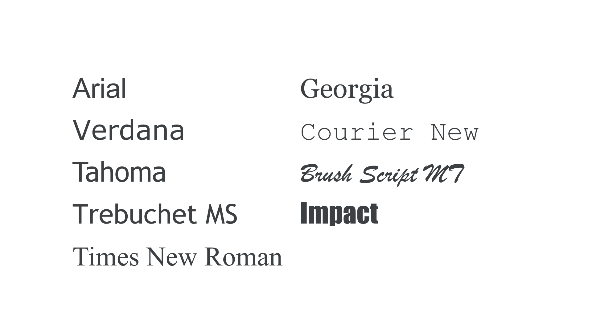

# Typography

As a review, here are some basic CSS properties that deal with font styling and sizing:

- [color](https://developer.mozilla.org/en-US/docs/Web/CSS/Reference/Properties/color)
- [font-family](https://developer.mozilla.org/en-US/docs/Web/CSS/Reference/Properties/font-family)
- [font-size](https://developer.mozilla.org/en-US/docs/Web/CSS/Reference/Properties/font-size)
- [font-weight](https://developer.mozilla.org/en-US/docs/Web/CSS/Reference/Properties/font-weight)
- [line-height](https://developer.mozilla.org/en-US/docs/Web/CSS/Reference/Properties/line-height)

Choosing a specific typeface is done with the **font-family** property. For example, this CSS snippet would set "Arial" as the typeface for the `<main>` element and all of its children:

```css
main {
  font-family: Arial;
}
```

When choosing a typeface for your designs, there are essentially two paths: [**web-safe fonts**](https://fonts.google.com/knowledge/glossary/system_font_web_safe_font) or **custom fonts**.

## Web-safe Fonts

**Web-safe fonts** are typefaces that you can assume are already installed on a user's device. This means that simply specifying the `font-family` is sufficient, and content will display reliably across most devices.

_Tip: If you want to keep things simple, stick to web-safe fonts!_

The following typefaces are considered "web-safe":

- Arial
- Verdana
- Tahoma
- Trebuchet MS
- Times New Roman
- Georgia
- Courier New
- Brush Script MT
- Impact

<figure markdown="span">
  { width="80%" }
</figure>

## Custom Fonts

**Custom fonts** are essentially any typefaces that _are not_ considered "web-safe." While these are also specified using the `font-family` property, the actual font file must be loaded for the font to display correctly.

Depending on the source, there can be different ways to load font files. Regardless of the source, it's important to remember that you must have access to the actual font file to use it in your design. Typically, fonts found in design applications, like those included with Adobe Creative Cloud, _are not_ free (though they are included with a paid subscription). There are also several free options from sources like [Google Fonts](https://fonts.google.com).

### Online Font Services

Adobe and Google Fonts both provide online hosting for their fonts. This can often be the simplest way to load font files, since it only requires adding the provided `<link>` tags to the `<head>` of your HTML document.

For example, this is how the **Roboto** font from Google Fonts can be loaded and applied to `<main>`:

```html
<!-- added to the <head> element -->
<link rel="preconnect" href="https://fonts.googleapis.com" />
<link rel="preconnect" href="https://fonts.gstatic.com" crossorigin />
<link
  href="https://fonts.googleapis.com/css2?family=Roboto:ital,wght@0,100..900;1,100..900&display=swap"
  rel="stylesheet"
/>
```

```css
main {
  font-family: 'Roboto';
}
```

### Self-hosting Fonts

"**Self-hosting**" really just means that you have published the font file along with your HTML and CSS files. This can be done simply by adding the font file to your project folder. These files should have one of the following extensions:

- `.woff`
- `.woff2`
- `.otf`
- `.ttf`

Once the file has been added to your folder, it needs to be imported into your CSS file using a `@font-face` rule, where you provide a name for the `font-family` (your choice) and a `src` pointing to the file (the file name).

```css
@font-face {
  font-family: 'Roboto';
  src: url('Roboto-Regular.ttf');
}

main {
  font-family: 'Roboto';
}
```

_Note: Self-hosting of any files, including fonts, is not provided with the free tier of CodePen._

## Fallback Fonts

It's generally a good idea to specify a **fallback font** after your chosen font. This tells the browser what typeface to use if, for some reason, the primary font does not load correctly. You can add specific typefaces as fallbacks (e.g., Arial, Helvetica, etc.) or generic families (e.g., serif, sans-serif, etc.).

```css
main {
  font-family: 'Roboto', Arial, sans-serif;
}
```
