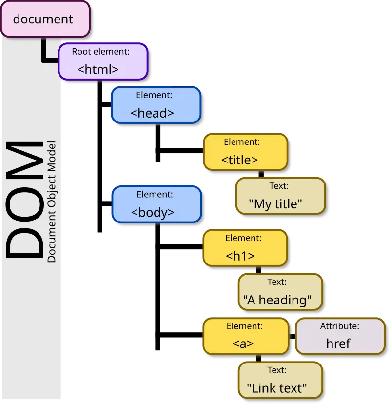

# DOM Manipulation

_Reminder: The Document Object Model (DOM) is the "representation of the objects that comprise the structure and content of a document on the web." It represents the page in a way that programs, like JavaScript, can manipulate the document structure, style, and content._

_You can review more on the [DOM Properties and Methods page](../dom-properties-and-methods)._

One way to conceptualize the structure of the DOM is as a hierarchical tree of _parents_ and _children_.

<figure markdown="span">
  { width="500px" }
  <figcaption>DOM Tree (image source: Wikipedia)</figcaption>
</figure>

In the example diagram shown above, all elements are children of the `<html>` root element. The `<body>` has two child elements: an `<h1>` and an `<a>`. The corresponding HTML might look something like this:

```html
<!DOCTYPE html>
<html lang="en">
  <head>
    <meta charset="UTF-8" />
    <meta name="viewport" content="width=device-width, initial-scale=1.0" />
    <title>My title</title>
  </head>

  <body>
    <h1>A heading</h1>
    <a href="https://www.google.com">Link text</a>
  </body>
</html>
```

Take a look at the following example and, before opening the HTML editor, think about how might describe the structure in terms of parents and children.

<p class="codepen" data-height="500" data-default-tab="result" data-slug-hash="XWGrjOq" data-editable="true" data-user="ersheff" style="height: 500px; box-sizing: border-box; display: flex; align-items: center; justify-content: center; border: 2px solid; margin: 1em 0; padding: 1em;">
  <span>See the Pen <a href="https://codepen.io/ersheff/pen/XWGrjOq">
  Parent-Child (IMS322 Docs)</a> by Eric Sheffield (<a href="https://codepen.io/ersheff">@ersheff</a>)
  on <a href="https://codepen.io">CodePen</a>.</span>
</p>

Upon opening the HTML editor (or the browser's Inspector), you'll see that each `` has a `<figcaption>` sibling, both of which are children of a `<figure>` element. These `<figure>` elements are themselves children of the `<div>` flex row. Or, looking at it from the other direction, the `<div>` flex row is the parent element containing three `<figure>` children, each of which contains one `` child element and one `<figcaption>` child element.

## Creating Elements and Appending Children

If you were given a large collection of images in a folder to display in a responsive gallery site, you might manually create flexboxes for rows, `<figure>` or `<div>` elements for image containers, and `` elements in your HTML. But what if you were running a website for a cafe that featured different specials and events each week? It might be easier to automatically generate the HTML using information about the images in the folder.

Let's start simply. If you were to create an object with properties that describe a single menu item, it might look like this:

```js
const onionAndPeppercorns = {
  imageUrl: "https://picsum.photos/id/292/800/600.webp",
  alt: "onion and peppercorns",
  caption: "Onion and Peppercorns."
};
```

You can use JavaScript to create each required element using the `createElement()` method and set the necessary attributes:

```js
const figureElement = document.createElement("figure");
const imageElement = document.createElement("img");
const captionElement = document.createElement("figcaption");

// sets src attribute to "https://picsum.photos/id/292/800/600.webp"
imageElement.src = onionAndPeppercorns.imageUrl;
// sets alt text attribute to "onion and peppercorns"
imageElement.alt = onionAndPeppercorns.alt;
// sets inner text of <figcaption> to "Onion and Peppercorns."
captionElement.innerText = onionAndPeppercorns.caption;
```

Then, you can use the `appendChild()` method to append the `` and `<figcaption>` elements to the `<figure>` element and the `<figure>` element to the `<body>`.

<p class="codepen" data-height="500" data-default-tab="js,result" data-slug-hash="mdobOPe" data-editable="true" data-user="ersheff" style="height: 500px; box-sizing: border-box; display: flex; align-items: center; justify-content: center; border: 2px solid; margin: 1em 0; padding: 1em;">
  <span>See the Pen <a href="https://codepen.io/ersheff/pen/mdobOPe">
  Creating and Appending Elements (IMS322 Docs)</a> by Eric Sheffield (<a href="https://codepen.io/ersheff">@ersheff</a>)
  on <a href="https://codepen.io">CodePen</a>.</span>
</p>

## Creating and Appending Elements in a For Of Loop

Using the `createElement()` and `appendChild()` methods for a single object is good practice, but using them in a `for...of` loop for multiple objects showcases their power and flexibility.

In the example below, an array containing objects is used to generate elements for a grid of photos. Each object contains information about the photo source (url), alt text, and caption text.

<p class="codepen" data-height="680" data-default-tab="js,result" data-slug-hash="PoLpZQV" data-editable="true" data-user="ersheff" style="height: 680px; box-sizing: border-box; display: flex; align-items: center; justify-content: center; border: 2px solid; margin: 1em 0; padding: 1em;">
  <span>See the Pen <a href="https://codepen.io/ersheff/pen/PoLpZQV">
  Generating a Photo Grid with a For Of Loop (IMS322 Docs)</a> by Eric Sheffield (<a href="https://codepen.io/ersheff">@ersheff</a>)
  on <a href="https://codepen.io">CodePen</a>.</span>
</p>
<script async src="https://cpwebassets.codepen.io/assets/embed/ei.js"></script>
