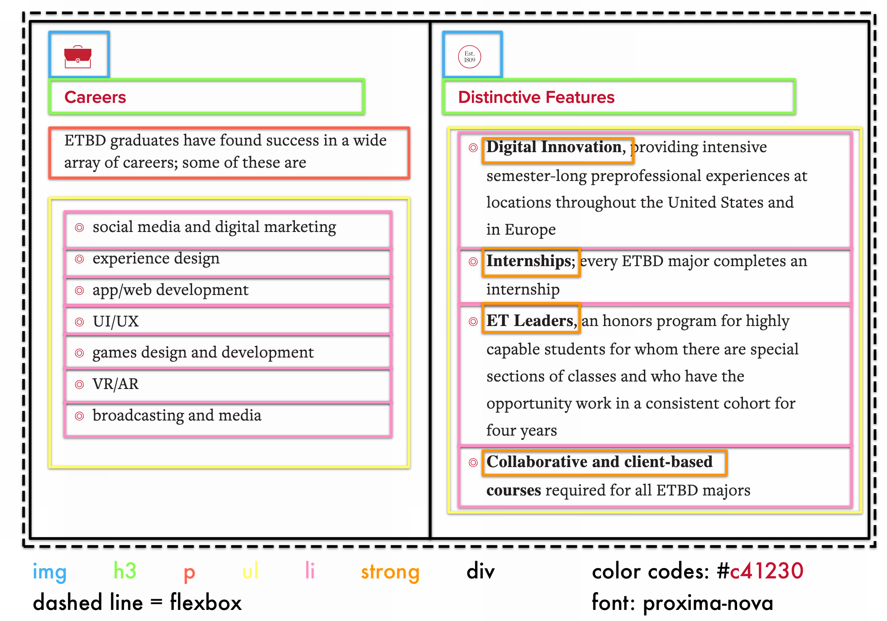
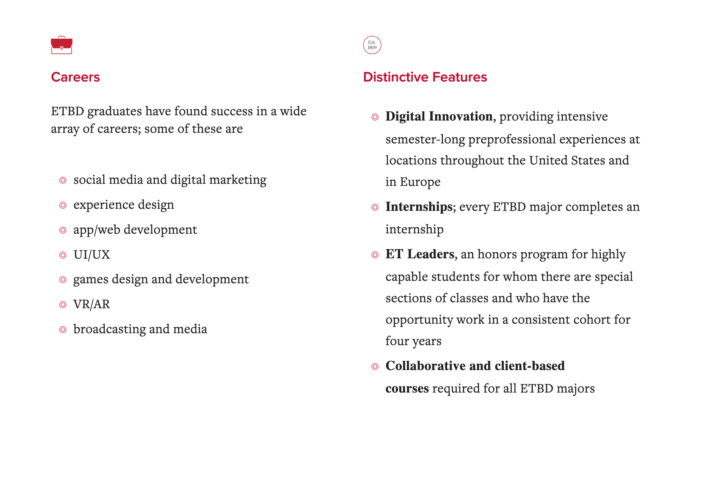

# Wireframes

In this class, the objective for wireframes is to create a visual representation that closely matches the desired final product, including the actual image files that will be used. Your wireframes should also include annotations for the following:

- **Color-coded outlines** representing the planned HTML structure.
- The **font family or families** intended for the final design.
- **HEX or RGB color codes** defining the design's color scheme.

For submission, you’ll need to provide both an **annotated** and **unannotated** version of your wireframe. To streamline this process, it’s recommended to use a drawing application with layers, allowing you to easily toggle annotations on and off before exporting.

Most projects in this class will include an assessment of how accurately the wireframe is translated into the final submission.

<figure markdown="span">
  { width="800" }
  <figcaption>Wireframe Example: Annotated</figcaption>
</figure>

<figure markdown="span">
  { width="800" }
  <figcaption>Wireframe Example: Unannotated</figcaption>
</figure>
