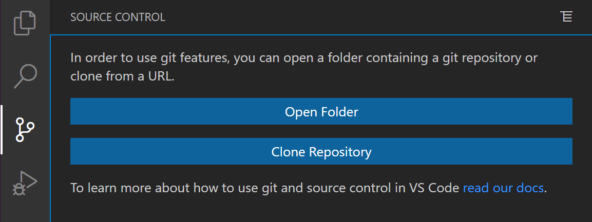
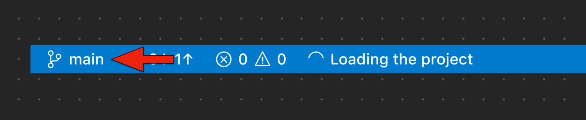

# Setup

The sections on this page will lead you through the process of setting up the applications and accounts needed to complete IMS322 coursework. It is recommended that you follow the steps below in the order listed:

1. Install [Git](#git).
2. Create a [GitHub](#github) account (if needed).
3. Log in to [CodePen](#codepen), enable **Format on Save** in account settings, and create your first Pen.
4. Install additional [browsers](#browsers) as needed.
5. Install [VS Code](#vs-code) and configure extensions and settings.
6. Review coding [assignment procedures](#assignment-procedures).

---

## Git

[Git](https://git-scm.com) is a "version control system" that helps track and manage changes in files. While Git itself is very powerful, we will only be using it through the **Source Control** panel in VS Code.

<figure markdown="span">
  { width="400" }
  <figcaption>Activity Bar: Source Control panel</figcaption>
</figure>

### Mac

Mac users should follow the Homebrew installation option:

1. Install [Homebrew](https://github.com/Homebrew/brew/releases/download/4.3.18/Homebrew-4.3.18.pkg).
2. Run `brew install git` in Terminal.

### Windows

Windows users should use the 64-bit Git for Windows Setup under [Standalone Installer](https://git-scm.com/download/win).

### Linux

If you're using Linux, you probably don't need help installing Git! Follow the instructions [here](https://git-scm.com/download/linux).

---

## GitHub

[GitHub](https://github.com) is a platform for creating, storing, and managing code. It relies on Git to commit and sync changes between files stored locally on your computer (the ones that you'll be editing in VS Code) and online repositories. In this class, we will be using GitHub to manage all major assignments.

1. Create a [GitHub](https://github.com) account.
2. Register for GitHub [Student Benefits](https://github.com/education/students) (this will give you access to the GitHub Copilot AI assistant within VS Code).

---

## CodePen

[CodePen](https://codepen.io/) is a popular online code editor focused on creating and sharing snippets of HTML, CSS, and JavaScript. The embedded code examples throughout the IMS322 Docs site have been created using CodePen. One of the main reasons that we use CodePen for this class is because it allows you to edit embedded examples right on the page and see live results - try it out below! We will also regularly use CodePen instead of VS Code for smaller assignments, like weekly practice and in-class exercises.

There are a few important things to note about CodePen and how it differs from the VS Code and GitHub workflow:

- You should log in to CodePen using your GitHub username and password. There is no actual connection between CodePen and GitHub; it simply uses the same account credentials.
- A project on CodePen is called a "Pen." By default, a Pen includes HTML, CSS, and JavaScript editors, as well as a live preview.
- Make sure that the **Format On Save** and **Autocomplete** options are checked in your account settings (found in the **Editor Preferences** section).
- The simplified HTML editor does not need a `<head>` element or `<body>` tags. You should start your HTML content from the first tag that would normally go after the opening `<body>` tag, like a `<header>` or `<h1>` element.
- There is no file hosting provided with free CodePen accounts. When you want to include images in CodePen assignments, you will need to use a URL instead of a file name for the `src` attribute of the `` element. Generally, the content of images in CodePen-based assignments is not important, so a random image hosting service like [Lorem Picsum](https://picsum.photos) will suffice.

<p class="codepen" data-height="400" data-default-tab="html,result" data-slug-hash="WNPVYVb" data-pen-title="Embed Example (IMS322 Docs)" data-editable="true" data-user="ersheff" style="height: 400px; box-sizing: border-box; display: flex; align-items: center; justify-content: center; border: 2px solid; margin: 1em 0; padding: 1em;">
  <span>See the Pen <a href="https://codepen.io/ersheff/pen/WNPVYVb">
  Embed Example (IMS322 Docs)</a> by Eric Sheffield (<a href="https://codepen.io/ersheff">@ersheff</a>)
  on <a href="https://codepen.io">CodePen</a>.</span>
</p>
<script async src="https://cpwebassets.codepen.io/assets/embed/ei.js"></script>

---

## Browsers

Although there are many different modern web browsers, there are essentially only three different [browser engines](https://en.wikipedia.org/wiki/Browser_engine) currently in use. A browser engine is the software component under the hood that handles document layout, rendering, and security.

- **WebKit** is maintained by Apple and used for the desktop and mobile versions of [Safari](https://www.apple.com/safari/), which is the default browser on Apple devices.
- **Blink** is maintained by Google and powers all Chromium-based browsers, which include [Google Chrome](https://www.google.com/chrome/), [Microsoft Edge](https://www.microsoft.com/en-us/edge), [Brave](https://brave.com/), [Opera GX](https://www.opera.com/gx), and others.
- **Gecko** is maintained by Mozilla and used for [Firefox](https://www.mozilla.org/en-US/firefox/).

You should have _both_ Firefox and at least one Chromium-based browser installed on your laptop for this class. It is also recommended that you set one of these as the **Live Server Custom Browser** during VS Code configuration (instructions provided below).

---

## VS Code

[Visual Studio Code](https://code.visualstudio.com) (aka VS Code) is the code editor that we will be using for all major assignments in this class. After installing the VS Code application, follow the instructions below to configure extensions and settings.

### Extensions

We will be using a small collection of VS Code extensions to assist with formatting and development. Search for the following extensions in the **Extensions** panel to install them:

- **GitHub Copilot** and **Copilot Chat** AI code assistant (published by GitHub, requires GitHub Student Benefits activation)
- **JS-Beautify for VS Code** for HTML formatting (published by VSCE Toolroom)
- **Prettier** for CSS and JavaScript formatting (published by Prettier)
- **Live Server** for quick and easy browser previews (published by Ritwick Dey)
- **Live Share** for collaborative coding (published by Microsoft)

<figure markdown="span">
  { width="400" }
  <figcaption>Activity Bar: Extensions panel</figcaption>
</figure>

### Git Setup and GitHub Login

_Make sure that Git has finished installing before completing these steps._

1. Click on the **Terminal** menu and choose **New Terminal**.
2. In the **Terminal** panel, run the two commands provided below, inserting your own GitHub username and email where indicated (you will not see a confirmation message):
3. Click the **Accounts** icon in the lower-left corner and sign in using your GitHub account.

```
git config --global user.name "your_username"
git config --global user.email your@email.com
```

<figure markdown="span">
  { width="400" }
  <figcaption>Activity Bar: Accounts</figcaption>
</figure>

### Editor Settings

1. Go to the **View** menu and choose **Command Palette...** Use the search field to find and run the **Preferences: Open User Settings (JSON)** command. Copy-paste the text below into the open settings.json file, replacing any existing text, then save and close the file.
2. Click on the gear icon in the lower-left and choose **Settings**. Search for **Live Server Custom Browser** and choose your preferred browser from the dropdown menu (Firefox or Chromium-based). This is the browser that will open automatically whenever you run the Live Server extension.
3. Right-click the **Activity Bar** on the left side of the window. Uncheck **Run and Debug**. Ensure that only **Explorer**, **Search**, **Source Control**, **Extensions**, **Live Share**, **Chat**, and **Accounts** are checked.

```json
{
  "editor.minimap.enabled": false,
  "breadcrumbs.enabled": false,
  "editor.tabSize": 2,
  "editor.formatOnSave": true,
  "prettier.trailingComma": "none",
  "[html]": {
    "editor.defaultFormatter": "vsce-toolroom.vscode-beautify"
  },
  "[css]": {
    "editor.defaultFormatter": "esbenp.prettier-vscode"
  },
  "[javascript]": {
    "editor.defaultFormatter": "esbenp.prettier-vscode"
  },
  "[json]": {
    "editor.defaultFormatter": "esbenp.prettier-vscode"
  }
}
```

---

## Assignment Procedures

Throughout the semester, coursework will be assigned using both CodePen and VS Code with GitHub. Some specific instructions and details in the Canvas assignment descriptions may differ on a case-by-case basis, but the general workflow for both platforms is outlined below.

### Accepting CodePen Assignments

1. If the Canvas assignment instructions point to an embedded example Pen, click **Edit On CodePen**, then create a copy of it in your account by clicking the **Fork** button in the lower-right corner of the editor window. Otherwise, create a new empty Pen.
2. Change the Pen name to the name provided in the Canvas assignment and click Save. If you need to find this Pen again later, it will be in **Your Work**.

<figure markdown="span">
  { width="400" }
  <figcaption>Edit On CodePen</figcaption>
</figure>

<figure markdown="span">
  { width="500" }
  <figcaption>CodePen: Fork</figcaption>
</figure>

### Submitting CodePen Assignments

1. Click the **Save** button in the upper-right corner of the CodePen window.
2. Click **Share** in the bottom-right corner and select **Copy Link**.
3. Paste the copied link in the Website URL field of the corresponding Canvas assignment and click **Submit Assignment**.

<figure markdown="span">
  { width="500" }
  <figcaption>CodePen: Save and Share</figcaption>
</figure>

### Accepting and Cloning VS Code Assignments

_The first time you accept a VS Code assignment through GitHub Classroom, you will be asked to link your GitHub account to your name._

1. Click the link in the corresponding Canvas assignment to accept the assignment on GitHub Classroom. Once your new repository is generated, it should be visible in your **Top Repositories** on GitHub. You can also find it by visiting the IMS322-Sheffield-F24 organization.
2. Open VS Code. If an existing folder is already open, close it by going to the **File** menu and choosing **Close Folder**.
3. Open the **Source Control** panel and click the **Clone Repository** button. Copy-paste the URL from your repository into the text field. You will be prompted for a location on your computer to save this folder.
4. To open this folder in the future, go to the **File** menu and choose **Open Folder...**

<figure markdown="span">
  { width="400" }
  <figcaption>Source Control: Clone Repository</figcaption>
</figure>

### Working With VS Code Assignments

- Folders are very important when working in VS Code. You should always check the top of the **Explorer** panel to make sure that you are working within the desired assignment folder. The primary open folder acts as the "root" of your workspace where you will find your HTML, CSS, and JavaScript files, as well as any subfolders (e.g., for images).
- To preview your code in the browser, click the **Go Live** button in the bottom-right corner of the window (which is part of the **Status Bar**). This will use the **Live Server** extension to launch your project in your preferred browser. If you accidentally lose your browser preview window, you can reopen the browser and navigate to `http://127.0.0.1:5500/` (replacing the last 4 digits with whatever port number appears in the **Status Bar** while the extension is running). Alternatively, you can click on the port number in the **Status Bar** to close the extension and relaunch it by clicking **Go Live** again.

<figure markdown="span">
  { width="500" }
  <figcaption>Status Bar: Go Live</figcaption>
</figure>

<figure markdown="span">
  { width="500" }
  <figcaption>Status Bar: Port #</figcaption>
</figure>

- Some assignments in VS Code will have 2 stages: an initial draft, followed by a final submission. We will manage these stages by using different "branches" on GitHub. This way, you can submit the assignment multiple times without needing to create multiple repositories.

      - By default, each GitHub repository is created with a "main" branch. This includes all assignment instructions and template files and will be the branch used for your final submission. Do not make any changes in the main branch until you are finished with your draft!
      - The name of the branch that you are currently working in will always be visible in the **Source Control Checkout** button in the lower-left corner (part of the **Status Bar**).
      - When starting an assignment that has a draft stage, the first thing that you should do after accepting and cloning the assignment is click on the **Source Control Checkout** button. This will open a menu for managing different branches. Choose **Create New Branch...** and name it "draft." The draft branch will automatically include all of the files from the main branch. Then, in the **Source Control** panel, click **Publish Branch**. You should stage, commit, and sync everything as usual in the draft branch before switching over to main (described below).
      - When you have finished your draft and are ready to start working on your final submission, you will need to "merge" everything from the draft branch into the main branch. To do so, switch to the main branch by clicking the **Source Control Checkout** button and choosing *main* from the menu. Then, in the **Source Control** panel, click the 3-dot button to open an action menu and choose **Branch** > **Merge...** When prompted to choose the branch to merge from, choose **draft**.
      - Merge conflicts may occur if changes are made in both the main and draft branches before merging. VS Code will highlight the conflicts that need to be resolved, but this can be a challenging process for beginners. Ideally, we will avoid merge conflicts altogether, but I recommend scheduling an office hours appointment if you run into this issue.

<figure markdown="span">
  { width="400" }
  <figcaption>Status Bar: Source Control Checkout button</figcaption>
</figure>

### Committing and Submitting VS Code Assignments

_These steps apply to both the draft (draft branch) and final (main branch) stages. It is recommended that you Stage and Commit after each major change (steps 1-3) and Sync often (step 4), even before you are finished._

1. Open the **Source Control** panel in VS Code.
2. Stage all changes by clicking the **+** next to **Changes**.
3. Enter a commit message and click the **Commit** button (use "finished" for your final commit).
4. The **Commit** button should change to a **Sync Changes** button. Click this to finish syncing the latest changes to your online GitHub repository.
5. Find your repository on GitHub.
6. Go to the **Settings** tab within the repository and navigate to the **Pages** section.
7. Under **Branch**, choose the appropriate branch (draft or main) and click **Save**.
8. After a few moments, if you refresh the page, there should now be a URL near the top next to a **Visit Site** button. If you click this button, you should see your site open in a new window.
9. Copy the URL generated by GitHub Pages, paste it in the Website URL field of the corresponding Canvas assignment, and click **Submit Assignment**.

<figure markdown="span">
  { width="300" }
  <figcaption>Source Control: Stage and Commit changes</figcaption>
</figure>

### Autograding

Assignments managed through GitHub will be run through an autograding process when they are committed and synced with the word "finished" in the commit message. The criteria checked during this process can be found on the [Style Guide](../style-guide) page.

To review autograding results:

1.  Navigate to your assignment repository on GitHub.
2.  Click on the **Actions** tab at the top of the repository page.
3.  In the **Actions** tab, click on the most recent item in the list of workflows that have been run.
4.  Click on the workflow run to view the details.
5.  On the workflow details page, you can see the status of each step.

If you would like to fix errors identified by the autograding logs, you may commit and sync changes as many times as needed before the assignment due date. Keep in mind that you will need to have the word "finished" in your commit message to rerun the autograding workflow. You can optionally amend the commit message with a number to keep track of subsequent attempts e.g., "finished 2".

---

## Setup Checklist

- [ ] I have installed Git (_not_ just GitHub Desktop).
- [ ] I have created my GitHub account.
- [ ] My GitHub Student Benefits are active.
- [ ] I have enabled the **Format On Save** and **Autocomplete** options in my CodePen account settings.
- [ ] I have both Chrome (or another Chromium-based browser) and Firefox installed.
- [ ] I have installed VS Code.
- [ ] I have installed the required VS Code extensions.

      - [ ] **GitHub Copilot** and **Copilot Chat** (published by GitHub)
      - [ ] **JS-Beautify for VS Code** (published by VSCE Toolroom)
      - [ ] **Prettier** (published by Prettier)
      - [ ] **Live Server** (published by Ritwick Dey)
      - [ ] **Live Share** (published by Microsoft)

- [ ] I have run the `git config` commands in the Terminal in VS Code.
- [ ] I have signed VS Code into my GitHub account.
- [ ] I have copy-pasted the suggested settings in the settings.json file.
- [ ] I have selected my **Live Server Custom Browser** in settings.
- [ ] I have ensured that **Explorer**, **Search**, **Source Control**, **Extensions**, **Live Share**, **Chat**, and **Accounts** are all visible in the Activity Bar.
