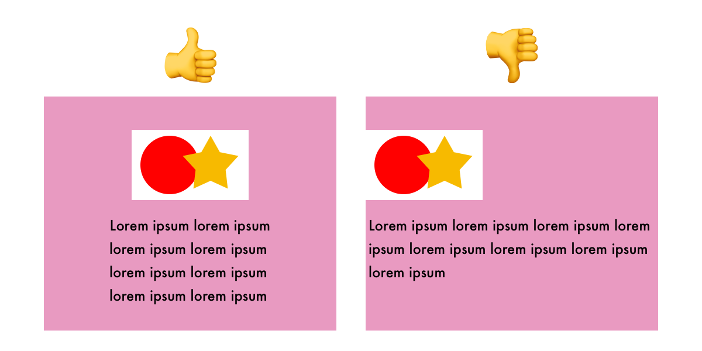

# Style Guide

The IMS322 Style Guide was designed to help you write well-organized code that is easier to read, edit, and troubleshoot for functional and responsive designs. Although it includes many widely adopted conventions, it is by no means intended to be the universal "best" or "correct" approach. After taking this class, you may consider other styles based on personal preference or professional expectations. However, keep in mind that much of the criteria below directly impacts your assignment grades.

This page is divided into 3 sections:

- **[Autograded Requirements](#autograded-requirements)**: The requirements in this section will be autograded by GitHub Actions after syncing your repository with "autograde" or "finished" as the commit message. You can read more about how to initiate this process and review the results on the [Setup](../setup/#autograding) page.

- **[Manually Graded Requirements](#manually-graded-requirements)**: The requirements in this section will be reviewed by the instructor after submission and graded using the assignment rubric in Canvas.

- **[Other Suggestions](#other-suggestions)**: This section includes other miscellaneous style suggestions. While they do not directly affect your assignment grades, implementing these suggestions may help improve your results.

---

## Autograded Requirements

### Default Files

Every assignment should start with the following three files:

- `index.html`
- `styles.css`
- `script.js`

These will be provided for you in each assignment template. Do not delete or rename them.

### Separation of Concerns

There are multiple aspects to this concept. Simply put, the goal is to only put HTML, CSS, and JavaScript in their respective files. By keeping these concerns separate, you can work on structure, style, and behavior independently.

The following items will be checked during the autograding workflow:

- Write all CSS in the `styles.css` file, which should be referenced in the `<head>` element using `<link>` tags. Avoid writing any CSS as inline `style` attributes or in `<style>` tags within the HTML.
- Write all JavaScript in the `script.js` file, which should be referenced in the `<head>` element using `<script>` tags with the `defer` keyword. Avoid writing any JavaScript code inside `<script>` tags within the HTML.
- Trigger JavaScript functions from event listeners defined in the `script.js` file, not from HTML attributes.

_This:_

```js
const counterButton = document.querySelector("#counter-button");
myButton.addEventListener("click", addCount);
```

_Not this:_

```html
<button onclick="addCount()">Click Me</button>
```

### JavaScript Loading

By default, the `<script>` tag in the `<head>` of your `index.html` file is initialized with the `defer` keyword. This ensures that `script.js` is downloaded in parallel with the HTML document but only executes after the HTML has been fully parsed.

It is important that you _do not_ remove the `defer` keyword, as doing so may cause errors if the script runs before the necessary HTML elements are available.

Additionally, do not use a `DOMContentLoaded` event listener or `window.onload` property in your JavaScript file. These are redundant when using `defer` and may cause issues in future projects.

### Image Compression, Resolution, and Organization

With one exception (noted below), all images used in your projects should be in WebP format with a _maximum_ resolution of 2200px in either dimension. Use [Squoosh](https://squoosh.app) or another preferred image editing application that can export `.webp` files to prepare your images before adding them to your project.

Things like logos, icons, or other vector drawings can be in SVG format. Keep in mind that `.svg` files typically need dimensions (width and/or height) specified in the CSS to be visible on the page.

Store image files in an "images" folder to help keep the file browser organized. Remember, this means that the folder name will need to be included in the file path.

_This:_

```html

```

_Not this:_

```html

```

### CSS Color Syntax

All CSS colors should be in HEX or RGB format to ensure that you can directly translate colors from your wireframe designs.

- Example HEX code: `#e9967a`
- Example RGB code: `rgb(233, 150, 122)`

Several color utilities are provided to help you choose and convert color codes on the [Utilities](../ref/utilities) page.

### Modern Javascript Variable Declarations

Use the keywords `let` (for values that will change) and `const` (for values that will not change) when declaring variables in JavaScript. Although it is still technically valid, do not use the outdated `var`.

_This:_

```js
let favoriteFruit = "apple";
const birthYear = 1986;
```

_Not this:_

```js
var favoriteFruit = "apple";
var birthYear = 1986;
```

---

## Manually Graded Requirements

### Font Selection and Loading

You should _always_ specify a font family in your CSS, even when using the browser default. You will either need to use a "web safe font" or include the desired font assets when using an alternative.

[Web safe fonts](https://www.w3schools.com/cssref/css_websafe_fonts.php) are fonts that you can safely assume are already installed on a user's computer:

- Arial (sans-serif)
- Verdana (sans-serif)
- Tahoma (sans-serif)
- Trebuchet MS (sans-serif)
- Times New Roman (serif)
- Georgia (serif)
- Courier New (monospace)
- Brush Script MT (cursive)

Otherwise, for simplicity, I recommend checking [Google Fonts](https://fonts.google.com) first, as it offers a large, searchable collection and is easy to include by adding the provided `<link>` tags to the `<head>` of your HTML file.

### Naming Conventions

- Rename long or cryptic image files as needed. For example, `dog.webp` is much easier to type and identify than `neom-9E9NsEiUGxg-unsplash.webp`.
- Use concise, searchable, and meaningful names for classes, ids, functions, and variables. Only use common, easy-to-remember abbreviations if a name becomes excessively long.
- Name class and id attributes in HTML and CSS using the "kebab-case" convention, where lowercase words are separated by hyphens.
- Name functions and variables in JavaScript using the "camelCase" convention, where each word (except the first) starts with a capital letter, without spaces or hyphens.
- Keep in mind that you will find yourself writing both kebab-case and camelCase in your JavaScript file when assigning HTML elements to variables. This is valid since the id name was created in the HTML file.

```html
<p class="kebab-case" id="kebab-case">Blah blah blah.</p>
```

```js
const camelCase = "apple";
```

```js
// camelCase variable name, kebab-case id

const counterButton = document.querySelector("#counter-button");
```

### Display Size Targets and General Layout

Your project layouts should accommodate the following window widths (based on [MDN Web Docs recommendations](https://developer.mozilla.org/en-US/docs/MDN/Writing_guidelines/Writing_style_guide/Code_style_guide/CSS#mobile-first_media_queries)):

- `480px` (mobile)
- `800px` (tablet, narrow laptop/desktop windows)
- `1100px` (wide laptop/desktop windows)

This means that text content and images are neither too small nor overflowing the visible area. Additionally, you should plan to use empty or "white" space effectively around the main content area and individual component blocks. Text or images that extend right to the edge of the browser window can result in a cluttered or disorganized look.

<figure markdown="span">
  { width="600" }
  <figcaption>Using Space</figcaption>
</figure>

The following CSS is provided for you in the assignment templates to help meet these requirements:

- Large paragraphs should not exceed a width of `80ch` to improve readability.
- Use media queries at `480px` and/or `800px` to rearrange or resize elements as needed.

_Default assignment template CSS:_

```css
* {
  box-sizing: border-box;
}

p {
  max-width: 80ch;
}

img {
  width: 100%;
}

/* media queries - keep at bottom */

@media (max-width: 800px) {
}

@media (max-width: 480px) {
}
```

---

## Other Suggestions

### Formatting

In both CodePen and VS Code, [js-beautify](https://beautifier.io) is used for HTML formatting and [Prettier](https://prettier.io) is used for CSS and JavaScript formatting. Formatting occurs automatically on save if both platforms are configured according to the [Setup](../setup) guide.

Provided your code is completely and properly structured (e.g., not missing tags or brackets), the following formatting should apply:

- Blank lines and indentation
- Proper spacing around operators, parentheses, and curly brackets
- Semicolons at the end of statements in JavaScript
- Single quotes `'` replaced with double quotes `"` in JavaScript

_HTML_

```html
<body>
  <header>
    <h1>My Big Project</h1>
  </header>

  <main>
    <p>Tons of great content here.</p>
    
  </main>

  <footer>
    <p>Like and subscribe!</p>
  </footer>
</body>
```

_CSS_

```css
h1 {
  color: #ff0000;
}

p {
  color: #0000ff;
}
```

_JavaScript_

```js
let favoriteFruit = "apple";

if (favoriteFruit === "apple") {
  declareLove();
}

function declareLove() {
  console.log("I like apples, too!");
}
```

### Relative Units

Prioritize using relative units in CSS whenever possible to improve responsiveness and consistency in sizing and spacing. Common examples of relative units include:

- `%` - Percentage relative to the parent element.
- `ch` - The width of a character in the element's font size.
- `rem` - Relative to the root element's font size (the browser default).

When using absolute units, such as `px`, aim for consistent and logical increments e.g., multiples of 2 or 10. Adopting CSS variables can help with this by allowing you to define and adjust size denominations in one place.

You can read more about valid absolute and relative units in this [MDN Web Docs reference](https://developer.mozilla.org/en-US/docs/Learn/CSS/Building_blocks/Values_and_units#numbers_lengths_and_percentages).

### CSS Style Selectors

Use element and class selectors, as well as CSS nesting, instead of id selectors in CSS. This approach helps reinforce the [separation of concerns](#separation-of-concerns) by reserving id attributes for assigning HTML elements to variables in JavaScript.

```css
/* element selector */
h2 {
  color: #0000ff;
}

/* class selector with nesting */
.warning {
  color: #ff0000;
  font-weight: bold;

  button {
    background-color: #ff9999;
  }
}
```

#### BEM

There is a CSS class naming methodology called **Block-Element-Modifier** (BEM) that can help with code organization. Generally, the three parts are defined as follows:

- Block
  - Standalone entity that is meaningful on its own.
  - Examples: `header`, `container`, `menu`, `checkbox`, `input`
- Element
  - A part of a block that has no standalone meaning and is semantically tied to its block.
  - Examples: `menu item`, `list item`, `checkbox caption`, `header title`
- Modifier
  - A flag on a block or element. Use them to change appearance or behavior.
  - Examples: `disabled`, `highlighted`, `checked`, `fixed`, `size big`, `color yellow`

You can read more about the BEM methodology at the following sites:

- [Get BEM](https://getbem.com)
- ["BEM 101" on CSS Tricks](https://css-tricks.com/bem-101/)

**BEM** takes advantage of the fact that class names can include \_ and - characters, and an HTML element can have multiple classes. Some combinations may take the following formats:

```css
.block--modifier {
}

.block--modifier-value {
}

.block__element {
}

.block__element--modifier {
}

.block__element--modifier-value {
}
```

For example:

```html
<form class="form form--theme-xmas form--simple">
  <input class="form__input" type="text" />
  <input class="form__submit form__submit--disabled" type="submit" />
</form>
```

```css
.form {
}
.form--theme-xmas {
}
.form--simple {
}
.form__input {
}
.form__submit {
}
.form__submit--disabled {
}
```
